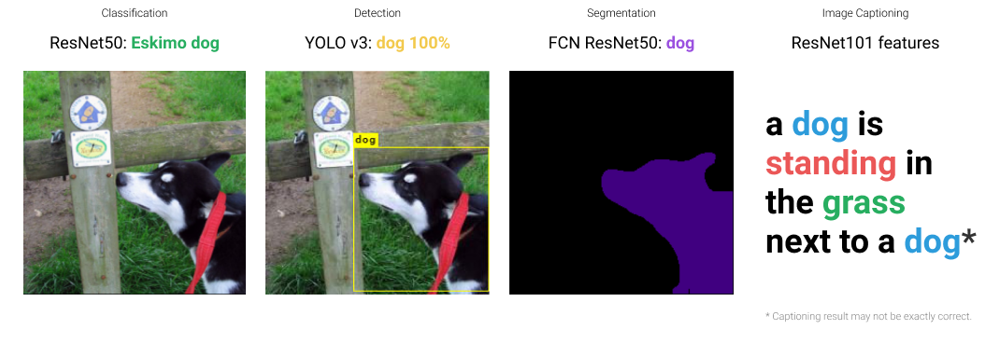

# Imagenetto

`imagenetto` is a small scale subset of 10 carefully chosen classes from
[ImageNet](http://www.image-net.org/) containing ~3,000 training and
validation images.

## Quick usage

### Download

You can download the dataset (which contains 10 classes, each with ~300 images)
from: [GitHub Release -
imagenet_all_rounder](https://github.com/spencerwooo/imagenet-all-rounder/releases/latest).

* `imagenet_all_rounder.tar.gz` contains gzipped files of this dataset with a
  80/20 train/val split ratio.
* `imagenet_all_rounder_no_split.tar.gz` contains gzipped files of the non-split
  version of this dataset.

### Demo



### Using the dataset

You can load the dataset with PyTorch and torchvision.

```python
import os
import torch
import torchvision
from torchvision.transforms import transforms

# The root folder of the imagenet-all-rounder dataset
dataset_root = "./imagenet_all_rounder"

# Define a transform with random cropping and normalization
transform = {
    "train": transforms.Compose(
        [
            transforms.RandomResizedCrop(244),
            transforms.RandomHorizontalFlip(),
            transforms.ToTensor(),
            transforms.Normalize([0.485, 0.456, 0.406], [0.229, 0.224, 0.225]),
        ]
    ),
    "val": transforms.Compose(
        [
            transforms.Resize(256),
            transforms.CenterCrop(244),
            transforms.ToTensor(),
            transforms.Normalize([0.485, 0.456, 0.406], [0.229, 0.224, 0.225]),
        ]
    ),
}

# Load the dataset with torchvision ImageFolder
image_datasets = {
    x: torchvision.datasets.ImageFolder(
        root=os.path.join(dataset_root, x), transform=transform[x]
    )
    for x in ["train", "val"]
}
# Create a dataloader iterative
data_loaders = {
    x: torch.utils.data.DataLoader(
        image_datasets[x], batch_size=4, shuffle=True
    )
    for x in ["train", "val"]
}
# Calculate the size of each split of the dataset
data_sizes = {x: len(image_datasets[x]) for x in ["train", "val"]}

...
```

## Why this dataset?

I personally needed a dataset that can be used for multiple computer vision
tasks including:

* Image classification (of course).
* Object detection.
* Semantic segmentation.
* _(and maybe)_ Image captioning.

Although there exists larger _all-in-one_, _multi-purpose_ datasets like the
[Open Images Dataset](https://storage.googleapis.com/openimages/web/index.html),
I just wanted a small scale dataset to quickly validate my ideas and algorithms
(much like the purpose of the [imagenette
dataset](https://github.com/fastai/imagenette)). Also, class labels in the
_Imagenette_ dataset doesn't comply with other common pretrained detection,
segmentation, and captioning models (because they are most often trained with
COCO or Pascal VOC datasets). Hence, I present the `imagenet-all-rounder`!

## Specifications

### Structure

```text
imagenet_all_rounder
├── train
│   ├── Eskimo dog
│   │   └── xxx.png ...
│   ├── Persian cat
│   ├── airliner
│   ├── bullet train
│   ├── folding chair
│   ├── hummingbird
│   ├── monitor
│   ├── school bus
│   ├── speedboat
│   └── studio couch
└── val
    └── ...
```

### Labels

| Index | ImageNet Classes | ImageNet Labels | VOC Labels |
| :---- | :--------------- | :-------------- | :--------- |
| 1     | n02109961        | Eskimo dog      | dog        |
| 2     | n02123394        | Persian cat     | cat        |
| 3     | n02690373        | airliner        | aeroplane  |
| 4     | n02917067        | bullet train    | train      |
| 5     | n03376595        | folding chair   | chair      |
| 6     | n01833805        | hummingbird     | bird       |
| 7     | n03782006        | monitor         | tvmonitor  |
| 8     | n04146614        | school bus      | bus        |
| 9     | n04273569        | speedboat       | boat       |
| 10    | n04344873        | studio couch    | sofa       |

> Reference ImageNet class - label list:
> [aaronpolhamus/map_clsloc.txt](https://gist.github.com/aaronpolhamus/964a4411c0906315deb9f4a3723aac57).

### Training / Validation

This dataset has a **80%/20% train/validation** split.

## Caveats

There's no bounding-box annotations available yet, which means that you won't be
able to train detectors and such on this dataset. The purpose of this dataset is
more of an evaluation dataset rather than a training dataset.

## Clone with submodule

```bash
git clone --recurse-submodules -j8 git@github.com:daisylab-bit/imagenetto.git
```

## Behind the scenes

* See: [Behind the scenes.](./behind-the-scenes.md)

## Thanks

* [ImageNet Downloader](https://github.com/mf1024/ImageNet-Datasets-Downloader)
* [jfilter/split-folders](https://github.com/jfilter/split-folders)
* [fastai/imagenette](https://github.com/fastai/imagenette)

## License

[MIT](LICENSE).
